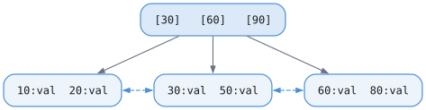
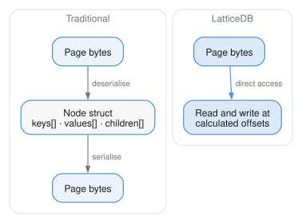
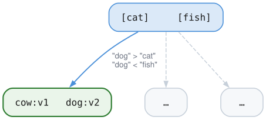
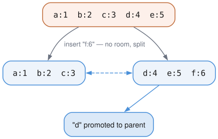
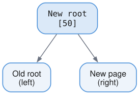
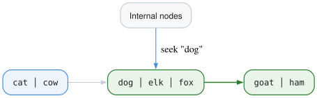
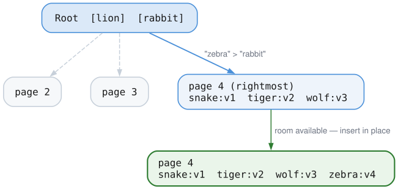

# B+Tree

## What It Is

A B+Tree is a self-balancing tree structure optimized for disk-based storage. It provides O(log N) lookups, inserts, and deletes, with efficient range scans.

## Why B+Tree?

### The Problem with Binary Trees

A binary search tree with 1 million entries is ~20 levels deep (log2(1M) ≈ 20). Each level requires a disk read. That's 20 disk reads per lookup!

### B+Tree: Wide and Shallow

A B+Tree has many keys per node (hundreds), making it very shallow:

```
Binary Tree (1M entries):          B+Tree (1M entries):
        depth ~20                       depth ~3

          ○                               ○
         / \                         /    |    \
        ○   ○                       ○     ○     ○
       /\   /\                    / | \ / | \ / | \
      ○ ○ ○  ○                   ○  ○  ○ ○  ○  ○ ○ ○
     ... (20 levels)             (leaf level)

    20 disk reads                   3 disk reads!
```

With 100 keys per node: log100(1M) ≈ 3 levels.

### Data Only in Leaves

B+Trees store all data in leaf nodes. Internal nodes only contain keys for routing:



## Our Implementation: Direct Page Manipulation

We don't create "node objects" in memory. Instead, we read/write bytes directly in page buffers. The "node" is just a lens over page bytes.



No intermediate objects. No serialization overhead.

## Page Layout

### Leaf Node

Leaf pages are slotted pages. The header and slot array grow forward from byte 0;
entry bytes grow backward from byte 4095; free space is whatever remains in the middle.

| Offset | Size | Field |
|--------|------|-------|
| 0–7 | 8 B | Page header — checksum, type (leaf), flags |
| 8–9 | 2 B | Entry count (u16) |
| 10–11 | 2 B | Flags (u16) |
| 12–15 | 4 B | Next leaf page (u32) |
| 16–19 | 4 B | Previous leaf page (u32) |
| 20 → | 2 B each | Slot array — one `entry_offset` (u16) per entry, growing forward |
| ← 4095 | variable | Entries, growing backward: `[key_len][value_len][key][value or overflow descriptor]` |

**Variable-length entries**: Keys and values are stored at the end of the page,
growing downward from high offsets. Slots at the front point to the entry
records.

Large values are stored through generic B+Tree overflow records. A leaf entry
uses the normal key bytes plus a compact overflow descriptor; the descriptor
contains the total value length, first overflow page, page count, checksum, and
a small local prefix. Point reads and range scans materialize the full value
transparently, and deletes free the overflow chain.

Values up to `64 MiB` are accepted by the B+Tree layer when the key and overflow
descriptor can fit in an empty leaf. Inline-capable values may still be stored
as overflow records when keeping them inline would make future 4 KiB leaf splits
impossible to divide into two valid ordered pages.

### Internal Node

Internal pages use the same slotted layout, but each slot carries a child pointer
alongside the key offset, and the values are separator keys rather than user data.

| Offset | Size | Field |
|--------|------|-------|
| 0–7 | 8 B | Page header — checksum, type (internal), flags |
| 8–9 | 2 B | Key count (u16) |
| 10–11 | 2 B | Level (u16; 0 = parent of leaves) |
| 12–15 | 4 B | Rightmost child (u32) |
| 16 → | 6 B each | Slot array — `key_offset` (u16) plus `child_page` (u32), growing forward |
| ← 4095 | variable | Separator keys, growing backward |

## Point Lookup

Finding a value by key:

```zig
pub fn get(self: *Self, key: []const u8) !?[]const u8 {
    // 1. Start at root
    var page_id = self.root_page;

    while (true) {
        // 2. Fetch page from buffer pool
        const frame = try self.bp.fetchPage(page_id, .shared);
        defer self.bp.unpinPage(frame, false);

        const page_type = getPageType(frame.data);

        if (page_type == .btree_leaf) {
            // 3. Binary search in leaf
            return LeafNode.search(frame.data, key, self.comparator);
        } else {
            // 4. Binary search for child pointer, descend
            page_id = InternalNode.findChild(frame.data, key, self.comparator);
        }
    }
}
```

**Example lookup for key "dog":**



## Insertion

### Simple Case: Space in Leaf

```zig
pub fn insert(self: *Self, key: []const u8, value: []const u8) !void {
    // 1. Find the leaf
    const leaf_page = try self.findLeaf(key);

    // 2. Fetch with exclusive latch
    const frame = try self.bp.fetchPage(leaf_page, .exclusive);
    defer self.bp.unpinPage(frame, true);

    // 3. Prepare either inline bytes or an overflow descriptor
    const prepared = try self.prepareStoredValue(key, value);

    // 4. Check if the prepared entry fits
    if (LeafNode.hasSpace(frame.data, key.len, prepared.value.len)) {
        // 5. Insert directly
        LeafNode.insert(frame.data, key, prepared.value, self.comparator);
    } else {
        // 6. Need to split
        try self.splitLeafAndInsert(frame, key, prepared);
    }
}
```

### Splitting a Leaf

When a leaf is full:



```zig
fn splitLeaf(self: *Self, frame: *BufferFrame, key: []const u8, value: []const u8) !void {
    // 1. Allocate new page
    const new_page = try self.pm.allocatePage();
    const new_frame = try self.bp.fetchPage(new_page, .exclusive);

    // 2. Find a byte-balanced split point that keeps both leaves valid.
    const split_point = try self.chooseLeafSplitPoint(frame.data, key, value);

    // 3. Move upper half to new page
    LeafNode.moveEntries(frame.data, new_frame.data, split_point, entry_count);

    // 4. Insert new key into appropriate page
    if (compare(key, split_key) < 0) {
        LeafNode.insert(frame.data, key, value);
    } else {
        LeafNode.insert(new_frame.data, key, value);
    }

    // 5. Update sibling pointers
    LeafNode.setNext(frame.data, new_page);
    LeafNode.setPrev(new_frame.data, frame.page_id);

    // 6. Get separator key and insert into parent
    const separator = LeafNode.getFirstKey(new_frame.data);
    try self.insertIntoParent(frame.page_id, separator, new_page);
}
```

The split point is chosen by serialized byte size, not just entry count. This
matters when a leaf mixes small keys with large values: both halves must fit in
the configured page size after the new entry is included.

### Growing the Tree

When the root splits, we create a new root:



The tree grows at the top, not the bottom. All leaves stay at the same depth.

## Range Scan

Thanks to linked leaves, range scans are efficient:

```zig
pub fn range(self: *Self, start: ?[]const u8, end: ?[]const u8) !Iterator {
    // 1. Find starting leaf
    const start_page = if (start) |k|
        try self.findLeaf(k)
    else
        try self.findLeftmostLeaf();

    return Iterator{
        .btree = self,
        .current_page = start_page,
        .current_slot = 0,
        .end_key = end,
    };
}
```

**Iterator walks the leaf chain:**



No need to traverse internal nodes for each entry - just follow the links.

## Concurrency

We use **latch crabbing** (simplified):

```
Lookup (read-only):
    1. Latch root (shared)
    2. Latch child (shared)
    3. Unlatch root
    4. Latch grandchild (shared)
    5. Unlatch child
    ... continue to leaf

Insert (may modify):
    1. Latch root (exclusive)
    2. If child is safe (won't split), latch child and unlatch root
    3. Continue down
```

A "safe" node is one with enough space that it won't split (for insert) or won't underflow (for delete).

## The BTree Struct

```zig
pub const BTree = struct {
    bp: *BufferPool,           // Page cache
    root_page: PageId,         // Current root
    comparator: KeyComparator, // For ordering
    page_size: u32,            // Usually 4096
    allocator: Allocator,

    // ...methods
};
```

This is just ~40 bytes of metadata. The actual data lives in pages on disk.

## Key Design Decisions

### Variable-Length Keys and Values

We store the actual bytes, not fixed-size slots. This supports:
- Short keys efficiently (no wasted space)
- Long keys (up to page size)
- Any binary data

### Separator Keys in Internal Nodes

Internal nodes store separator keys, not full key-value pairs. This maximizes fanout (keys per internal node).

### Delete Compaction and Leaf Merging

Deletes remove the slot, rebuild the surviving leaf entries contiguously, and
free any overflow chain owned by the removed entry. Afterward, adjacent leaves
under the same parent are merged whenever their combined payload fits on one
page. The redundant leaf is unlinked and returned to the freelist, and a root
with only that leaf remaining is collapsed. Space within a surviving leaf is
reusable immediately by later inserts or updates, while reclaimed pages are
reused by any later database allocation.

When a sparse leaf cannot merge because its sibling is too full, entries are
redistributed by stored byte size and the parent separator is updated. Removing
a leaf separator can in turn rebalance internal pages: compatible internal
siblings absorb their parent separator and merge, while oversized pairs
redistribute keys and promote a new separator. Rebalancing propagates to the
root, collapsing every now-redundant tree level.

### Page-Based, With Explicit Overflow

Each B+Tree node is exactly one page. Large values span linked overflow pages
through an explicit descriptor stored in the leaf; ordinary internal and leaf
pages remain fixed-size and directly addressable.

## Example: Full Insert Sequence

Insert "zebra" into a tree:



## Performance Characteristics

| Operation | Average Case | Worst Case |
|-----------|--------------|------------|
| Lookup    | O(log N)     | O(log N)   |
| Insert    | O(log N)     | O(log N)   |
| Range(k)  | O(log N + k) | O(log N + k) |

Where N is the number of entries and k is the number of entries in range.

Disk I/O per operation: ~3-4 reads for trees up to billions of entries.
