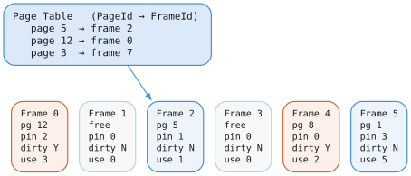
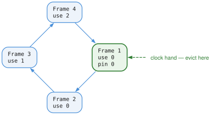

# Buffer Pool

## What It Is

The Buffer Pool is a cache that keeps frequently accessed pages in memory. Instead of reading from disk every time, we check the buffer pool first.

## The Problem It Solves

Disk I/O is slow:

| Operation | Typical latency |
|-----------|----------------:|
| CPU instruction | ~1 ns |
| RAM access | ~100 ns |
| SSD read | ~100,000 ns (100 µs) |
| HDD read | ~10,000,000 ns (10 ms) |

RAM is 1,000-100,000x faster than disk. If we can keep hot pages in RAM, performance improves dramatically.

## Architecture



## The Frame

Each frame holds one page:

```zig
pub const BufferFrame = struct {
    page_id: PageId,                    // Which page is here (0 = empty)
    data: []align(4096) u8,             // The actual 4KB page data
    pin_count: atomic(u32),             // Reference count
    dirty: bool,                        // Modified since read?
    usage_count: u8,                    // For Clock eviction
    latch: RwLatch,                     // Reader-writer lock
};
```

### Pin Count

The pin count is a reference count:

| Call | Effect | Meaning |
|------|--------|---------|
| `fetchPage()` | `pin_count += 1` | I am using this page |
| `unpinPage()` | `pin_count -= 1` | I am done with this page |

| Pin count | Consequence |
|-----------|-------------|
| `> 0` | Page is in use and cannot be evicted |
| `= 0` | Page may be evicted if a frame is needed |

### Dirty Flag

| Event | Dirty flag | Meaning |
|-------|-----------|---------|
| Read page | `false` | Frame matches disk |
| Modify page | `true` | Frame differs from disk |
| Write to disk | `false` | Frame matches disk again |

Dirty pages MUST be written to disk before eviction. Otherwise we lose data!

### Reader-Writer Latch

```
Multiple readers OR one writer

Read latch:    "I'm reading, others can read too"
Write latch:   "I'm modifying, exclusive access"
```

## Fetching a Page

```zig
pub fn fetchPage(self: *Self, page_id: PageId, mode: LatchMode) !*BufferFrame {
    self.mutex.lock();
    defer self.mutex.unlock();

    // 1. Check if already in buffer pool
    if (self.page_table.get(page_id)) |frame_id| {
        const frame = &self.frames[frame_id];
        frame.pin_count.fetchAdd(1, .monotonic);
        frame.usage_count = @min(frame.usage_count + 1, 255);
        acquireLatch(frame, mode);
        return frame;
    }

    // 2. Not in pool - need to load from disk
    const frame = try self.findVictimFrame();

    // 3. If victim is dirty, flush it first
    if (frame.dirty) {
        try self.pm.writePage(frame.page_id, frame.data);
        frame.dirty = false;
    }

    // 4. Update page table
    if (frame.page_id != NULL_PAGE) {
        self.page_table.remove(frame.page_id);
    }
    self.page_table.put(page_id, frame_id);

    // 5. Read page from disk
    try self.pm.readPage(page_id, frame.data);

    // 6. Set up frame
    frame.page_id = page_id;
    frame.pin_count.store(1, .monotonic);
    frame.dirty = false;
    frame.usage_count = 1;
    acquireLatch(frame, mode);

    return frame;
}
```

## The Clock Eviction Algorithm

When the buffer pool is full, we need to evict a page to make room. We use the Clock algorithm (also called "second chance").

### Why Clock?

- **LRU (Least Recently Used)** is optimal but expensive - requires updating timestamps on every access
- **Clock** approximates LRU cheaply using a usage bit

### How It Works

Imagine the frames arranged in a circle with a clock hand:



**To find a victim:**

```zig
fn findVictimFrame(self: *Self) !*BufferFrame {
    // Try free list first
    if (self.free_list.pop()) |frame_id| {
        return &self.frames[frame_id];
    }

    // Clock sweep
    var attempts: usize = 0;
    while (attempts < self.frame_count * 2) {
        const frame = &self.frames[self.clock_hand];

        // Move hand
        self.clock_hand = (self.clock_hand + 1) % self.frame_count;
        attempts += 1;

        // Skip pinned pages
        if (frame.pin_count.load(.monotonic) > 0) {
            continue;
        }

        // Second chance: if used recently, clear and skip
        if (frame.usage_count > 0) {
            frame.usage_count -= 1;
            continue;
        }

        // Found victim!
        return frame;
    }

    return error.BufferPoolFull;  // All pages pinned
}
```

**The key insight:** Usage count gives pages a "second chance". Recently used pages survive one clock sweep. Only pages that haven't been used in a full rotation get evicted.

## Unpinning Pages

When done with a page:

```zig
pub fn unpinPage(self: *Self, frame: *BufferFrame, dirty: bool) void {
    // Release latch
    frame.latch.release();

    // Mark dirty if modified
    if (dirty) {
        frame.dirty = true;
    }

    // Decrement pin count
    _ = frame.pin_count.fetchSub(1, .monotonic);
}
```

Always unpin! Failure to unpin causes:
- Pages stuck in memory forever
- Buffer pool eventually fills with pinned pages
- `BufferPoolFull` errors

## Flushing Pages

Writing dirty pages to disk:

```zig
// Flush one page
pub fn flushPage(self: *Self, page_id: PageId) !void {
    const frame = self.getFrame(page_id) orelse return;

    if (frame.dirty) {
        try self.pm.writePage(frame.page_id, frame.data);
        frame.dirty = false;
    }
}

// Flush all dirty pages
pub fn flushAll(self: *Self) !void {
    for (self.frames) |*frame| {
        if (frame.page_id != NULL_PAGE and frame.dirty) {
            try self.pm.writePage(frame.page_id, frame.data);
            frame.dirty = false;
        }
    }
}
```

## Thread Safety

The buffer pool is thread-safe:

1. **Mutex** protects page_table, free_list, clock_hand
2. **Per-frame latches** protect page data
3. **Atomic pin_count** for safe reference counting

| Step | Thread 1 — `fetchPage(5)` | Thread 2 — `fetchPage(5)` |
|-----:|---------------------------|---------------------------|
| 1 | `mutex.lock()` | `mutex.lock()` — blocked |
| 2 | look up page 5 | waiting |
| 3 | `pin_count++` | waiting |
| 4 | `mutex.unlock()` | `mutex.lock()` — acquired |
| 5 | `frame.latch.read()` | look up page 5 — found |
| 6 | read data | `pin_count++` |
| 7 | read data | `mutex.unlock()` |
| 8 | read data | `frame.latch.read()` |
| 9 | `unpinPage()` | read data |
| 10 | — | `unpinPage()` |

The page table mutex is held only long enough to find the frame and bump the pin
count. Reading the page data happens under the per-frame latch, so two readers of
the same page overlap rather than serialising.

Multiple threads can read the same page concurrently (shared latch).

## Memory Alignment

Page buffers are 4KB-aligned:

```zig
const data = try allocator.alignedAlloc(u8, 4096, page_size);
```

Why?

1. **Direct I/O**: Some systems require aligned buffers for O_DIRECT
2. **SIMD**: Aligned data enables vectorized operations
3. **Cache lines**: Better CPU cache utilization

## Sizing the Buffer Pool

```zig
// 64MB buffer pool = 16,384 pages
var bp = try BufferPool.init(allocator, &pm, 64 * 1024 * 1024);
```

Guidelines:
- **More is better** (to a point)
- **Working set**: Should fit frequently accessed pages
- **Available RAM**: Leave room for OS and other processes
- **Typical**: 25-75% of available RAM

### In-memory databases are different

All of the above assumes there is a disk to avoid. When the storage underneath is
already RAM — a `:memory:` database, or one opened from bytes — a cache miss costs
a copy from one part of memory to another rather than a trip to a device, so the
pool stops being the difference between fast and slow.

Measured on a fourteen megabyte in-memory database, twelve full scans took 9.2
seconds against a 256 KB pool and 9.9 against a 32 MB one. A hundred and twenty
times the memory bought nothing.

So an in-memory database gets a small fixed pool rather than a fraction of the
data. That keeps peak memory close to the size of the database itself, which
matters when the point of the feature is holding many small databases at once.

**The floor is a correctness requirement, not a tuning choice.** When the clock
sweep finds no evictable frame the pool returns `BufferPoolFull`, and that surfaces
as a failed query rather than a slow one. The pool must always have room for the
largest set of pages pinned simultaneously.

That number was measured rather than guessed, since guessing it trades memory
against query failures. Pools from four frames upward were run through a deep
variable-length traversal, a filtered scan, a full-text search, and a bulk write
over a fifteen-hundred node graph. Four frames completed all of it — the engine
does not hold many pages pinned at once. The floor sits at sixty-four, sixteen
times that, because the measurement was single threaded and concurrent readers
each pin pages of their own.

## Usage Pattern

```zig
var bp = try BufferPool.init(allocator, &pm, pool_size);
defer bp.deinit();  // Flushes dirty pages

// Read a page
const frame = try bp.fetchPage(page_id, .shared);
defer bp.unpinPage(frame, false);
const value = readValueFromPage(frame.data);

// Modify a page
const frame = try bp.fetchPage(page_id, .exclusive);
defer bp.unpinPage(frame, true);  // true = dirty
modifyPage(frame.data);
```

## Key Invariants

1. **Pin before access**: Never access page data without pinning
2. **Unpin when done**: Every fetchPage must have matching unpinPage
3. **Mark dirty**: If you modified the page, set dirty=true when unpinning
4. **Flush before close**: deinit() flushes, or call flushAll() explicitly
