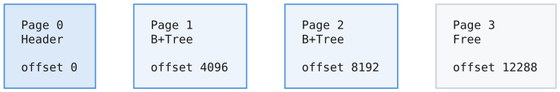

# Page Manager

## What It Is

The Page Manager handles the lowest level of database storage: fixed-size pages. It manages the database file structure, page allocation/deallocation, and data integrity through checksums.

## Why Fixed-Size Pages?

### Simplicity

Every piece of data lives in a 4KB page. This uniformity simplifies everything:



To read page N: `offset = N * 4096`

### Alignment with Hardware

- **SSD pages**: Modern SSDs have 4KB or 8KB internal pages
- **OS pages**: Most operating systems use 4KB virtual memory pages
- **Disk sectors**: Traditional HDDs use 512B or 4KB sectors

4KB aligns well with all of these, enabling:
- Direct I/O (bypassing OS cache)
- Atomic writes on some hardware
- Efficient memory mapping

### Efficient Caching

Fixed-size pages make the buffer pool trivial - every frame is the same size, no fragmentation.

## File Structure

### Page 0: File Header

The first page is special - it contains metadata about the database:

| Offset | Size | Field |
|--------|------|-------|
| 0–3 | 4 B | Magic number — `0x4C415454` (`"LATT"`) |
| 4–5 | 2 B | Format version |
| 6–7 | 2 B | Minimum reader version |
| 8–11 | 4 B | Page size (4096) |
| 12–15 | 4 B | Freelist head page |
| 16–23 | 8 B | Created timestamp |
| 24–31 | 8 B | Modified timestamp |
| 32–47 | 16 B | File UUID |
| 48 → | — | Reserved / padding |

Key fields:

- **Magic number**: Identifies this as a Lattice database file. Opening a random file will fail fast.
- **Format version**: Allows future changes to the format
- **Freelist head**: Points to the first free page (for allocation)
- **File UUID**: Unique identifier, used to match WAL files

### Data Pages

Every other page starts with a common header:

| Offset | Size | Field |
|--------|------|-------|
| 0–3 | 4 B | Checksum — CRC32 of bytes 8–4095 |
| 4 | 1 B | Page type — `btree_internal`, `btree_leaf`, and so on |
| 5 | 1 B | Flags |
| 6–7 | 2 B | Reserved |
| 8–4095 | 4088 B | Page-specific data |

## Page Types

```zig
pub const PageType = enum(u8) {
    free = 0,           // Unallocated, on freelist
    btree_internal = 1, // B+Tree internal node
    btree_leaf = 2,     // B+Tree leaf node
    overflow = 3,       // Large value overflow
    freelist = 4,       // Freelist continuation
};
```

## Page Allocation

### The Freelist

Free pages are linked together in a freelist:


### Allocating a Page

```zig
pub fn allocatePage(self: *Self) !PageId {
    // 1. Try freelist first
    if (self.header.freelist_page != NULL_PAGE) {
        return self.allocateFromFreelist();
    }

    // 2. Allocate at end of file
    const page_id = self.pageCount();

    // 3. Extend file with zeroed page
    var zeros: [4096]u8 = [_]u8{0} ** 4096;
    const header: *PageHeader = @ptrCast(&zeros);
    header.* = PageHeader.init(.free);

    try self.file.write(page_id * 4096, &zeros);

    return page_id;
}
```

### Allocating from Freelist

```zig
fn allocateFromFreelist(self: *Self) !PageId {
    const page_id = self.header.freelist_page;

    // Read the free page to get next pointer
    var buf: [4096]u8 = undefined;
    try self.readPageRaw(page_id, &buf);

    // Next pointer is stored after the 8-byte header
    const next_free = std.mem.readInt(u32, buf[8..12], .little);

    // Update freelist head
    self.header.freelist_page = next_free;
    try self.writeHeader();

    return page_id;
}
```

### Freeing a Page

```zig
pub fn freePage(self: *Self, page_id: PageId) !void {
    // 1. Can't free the header page
    if (page_id == 0) return error.InvalidPageId;

    // 2. Set up page as free, pointing to current freelist head
    var buf: [4096]u8 = [_]u8{0} ** 4096;
    const header: *PageHeader = @ptrCast(&buf);
    header.* = PageHeader.init(.free);

    // Store old freelist head as next pointer
    std.mem.writeInt(u32, buf[8..12], self.header.freelist_page, .little);

    // 3. Calculate checksum and write
    header.checksum = calculateChecksum(buf[8..]);
    try self.file.write(page_id * 4096, &buf);

    // 4. Update freelist head to this page
    self.header.freelist_page = page_id;
    try self.writeHeader();
}
```

This is a LIFO (stack) freelist - last freed is first allocated. Simple and efficient.

### Physical Tail Reclamation

Normal allocation reuses freelist pages without moving live pages, so file size
does not need to grow again after deletes. To return space to the operating
system, `lattice compact <path>` flushes and evicts the buffer pool, rebuilds
the retained freelist, persists a head that excludes tail pages, and truncates
the contiguous free run at physical EOF. Live pages and logical IDs never move.

The header is synced before truncation. A crash between those steps can leave
temporarily unreclaimed free pages, but cannot leave a freelist pointer beyond
the new end of the file.

## Checksums

Every page has a CRC32 checksum that covers bytes 8-4095 (everything after the checksum field itself).

### Why Checksums?

1. **Detect corruption**: Hardware failures, cosmic rays, bugs
2. **Detect torn writes**: Partial page writes from crashes
3. **Validate reads**: Catch errors before using bad data

### Checksum Calculation

```zig
pub fn calculateChecksum(data: []const u8) u32 {
    var crc = std.hash.Crc32.init();
    crc.update(data);
    return crc.final();
}
```

### Writing with Checksum

```zig
pub fn writePage(self: *Self, page_id: PageId, buf: []u8) !void {
    // Calculate checksum of everything after the checksum field
    const header: *PageHeader = @ptrCast(buf.ptr);
    header.checksum = calculateChecksum(buf[8..]);

    // Write to disk
    try self.file.write(page_id * 4096, buf);
}
```

### Reading with Verification

```zig
pub fn readPage(self: *Self, page_id: PageId, buf: []u8) !void {
    try self.file.read(page_id * 4096, buf);

    // Verify checksum
    const header: *const PageHeader = @ptrCast(buf.ptr);
    const expected = calculateChecksum(buf[8..]);

    if (header.checksum != expected and header.checksum != 0) {
        return error.ChecksumMismatch;
    }
}
```

Note: Checksum of 0 is allowed for newly allocated pages that haven't been written yet.

## Read-Only Mode

The Page Manager supports opening databases read-only:

```zig
var pm = try PageManager.init(allocator, vfs, "db.file", .{
    .read_only = true,
});

// This fails:
_ = try pm.allocatePage();  // error.PermissionDenied
try pm.writePage(1, &buf);  // error.PermissionDenied
```

Useful for:
- Backup tools
- Read replicas
- Forensic analysis

## Error Handling

```zig
pub const PageManagerError = error{
    InvalidHeader,      // File header is malformed
    InvalidMagic,       // Not a Lattice database file
    VersionTooNew,      // File created by newer version
    ChecksumMismatch,   // Data corruption detected
    InvalidPageId,      // Page ID out of range
    PageNotAllocated,   // Accessing unallocated page
    IoError,            // Underlying I/O failed
    PermissionDenied,   // Write to read-only database
    FileNotFound,       // Database file doesn't exist
    DiskFull,           // No space for new pages
};
```

## Thread Safety

The Page Manager itself is NOT thread-safe. Each operation directly touches the file. In a multi-threaded context, the Buffer Pool provides thread-safe access by:

1. Caching pages in memory
2. Using latches (reader-writer locks) per page
3. Serializing writes through its own mutex

## Usage Pattern

```zig
// Open or create database
var pm = try PageManager.init(allocator, vfs, "my.db", .{
    .create = true,
    .page_size = 4096,
});
defer pm.deinit();

// Allocate a page
const page_id = try pm.allocatePage();

// Write data
var buf: [4096]u8 align(4096) = undefined;
const header: *PageHeader = @ptrCast(&buf);
header.* = PageHeader.init(.btree_leaf);
// ... fill in page data ...
try pm.writePage(page_id, &buf);

// Read it back
var read_buf: [4096]u8 align(4096) = undefined;
try pm.readPage(page_id, &read_buf);

// Free the page
try pm.freePage(page_id);

// Ensure durability
try pm.sync();
```

## Key Design Decisions

### Fixed 4KB Pages

Chosen for hardware alignment. Could be made configurable (stored in header), but 4KB works well for most cases.

### Freelist in Pages

The freelist uses the free pages themselves for storage. No external data structure needed. Elegant and space-efficient.

### Checksum After Header

Checksum doesn't cover itself (circular dependency). By placing checksum first, we can compute it over the rest of the page in one pass.

### No Internal Fragmentation Tracking

We don't track free space within pages - that's the responsibility of higher layers (B+Tree). The Page Manager only deals with whole pages.
