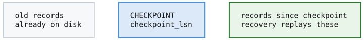
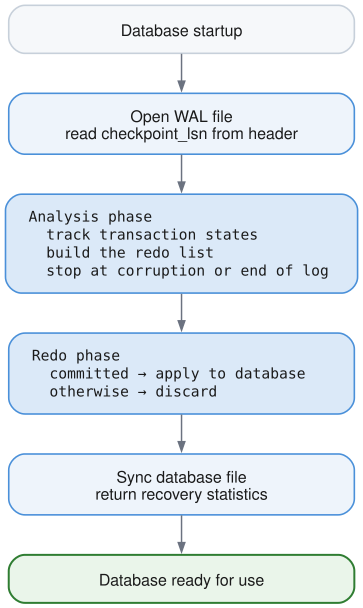

# Crash Recovery

## The Problem

Databases crash. Power fails, operating systems panic, processes get killed. When this happens, the database must be able to restart and return to a **consistent state** without losing committed data.

Consider what might be in-flight when a crash occurs:

```
Scenario: Crash during normal operation

Buffer Pool (RAM):
  Page 5: dirty, modified by committed txn
  Page 8: dirty, modified by uncommitted txn
  Page 12: dirty, partially written by in-progress txn

WAL (Disk):
  [committed txn records][uncommitted txn records][partial frame?]

Database File (Disk):
  [old versions of pages - some stale, some current]
```

After restart, we need to:
1. **Redo committed work** - If a transaction committed (COMMIT record in WAL) but its changes weren't flushed to the database file, redo them
2. **Ignore uncommitted work** - If a transaction never committed, pretend it never happened

## The ARIES Philosophy

Our recovery is inspired by ARIES (Algorithms for Recovery and Isolation Exploiting Semantics), a recovery algorithm developed at IBM. The key insight:

> **Write-Ahead Logging + Redo at Recovery = Durability**

The WAL contains everything we need. After a crash:
1. Read the WAL from the last checkpoint
2. Determine which transactions committed
3. Redo only committed operations

## Two-Phase Recovery

### Phase 1: Analysis

Scan the WAL to understand what happened:

| LSN | Record | Transaction | Meaning |
|----:|--------|------------:|---------|
| 1 | `TXN_BEGIN` | 1 | Transaction 1 started |
| 2 | `INSERT` | 1 | Transaction 1 modified data |
| 3 | `TXN_BEGIN` | 2 | Transaction 2 started |
| 4 | `INSERT` | 2 | Transaction 2 modified data |
| 5 | `TXN_COMMIT` | 1 | Transaction 1 committed |
| 6 | `UPDATE` | 2 | Transaction 2 modified data |

The process crashes after LSN 6, giving:

| Transaction | State |
|------------:|-------|
| 1 | `COMMITTED` — has `TXN_COMMIT` |
| 2 | `IN_PROGRESS` — no commit or abort |

During analysis, we build:
1. **Transaction table**: State of each transaction (committed, aborted, in-progress)
2. **Redo list**: All data operations that might need to be redone

### Phase 2: Redo

Apply committed operations to the database:

For each operation in the redo list:

1. Check whether its transaction committed. If not, skip it — the change is discarded.
2. Apply the operation to the database file.
3. Continue to the next operation.

Against the log above:

| LSN | Operation | Transaction | Outcome |
|----:|-----------|------------:|---------|
| 2 | `INSERT` | 1 | Redo — transaction 1 committed |
| 4 | `INSERT` | 2 | Skip — transaction 2 never committed |
| 6 | `UPDATE` | 2 | Skip — transaction 2 never committed |

## Why No Undo?

Traditional ARIES has three phases: Analysis, Redo, **Undo**. We skip Undo because of how we structure our system:

**Our approach**: Don't apply changes to data pages until commit
- During a transaction, changes are in the buffer pool (RAM)
- On commit, dirty pages are flushed
- On crash, uncommitted changes in RAM are simply lost

**Traditional approach**: Apply changes immediately, undo on abort
- Changes written to data pages as transaction runs
- If abort/crash, must read WAL backwards and undo each change
- More complex, but allows larger transactions (not limited by RAM)

For an embedded database like Lattice, the simpler "don't undo" approach works well.

## The Checkpoint Starting Point

Recovery doesn't scan the entire WAL - only from the last checkpoint:



The `checkpoint_lsn` in the WAL header marks where recovery begins. The Checkpointer sets this after successfully flushing all dirty pages.

## Transaction States

During recovery, each transaction can be in one of three states:

| State | Meaning | WAL Record | Action |
|-------|---------|------------|--------|
| `committed` | Completed successfully | TXN_COMMIT present | Redo operations |
| `aborted` | Explicitly rolled back | TXN_ABORT present | Ignore operations |
| `in_progress` | Crash during execution | No commit/abort | Ignore operations |

The distinction between `aborted` and `in_progress` is informational - both are handled the same way (ignore their changes).

## Record Type Handling

Different WAL records are handled differently:

```zig
switch (record.record_type) {
    .txn_begin => {
        // Track new transaction as in_progress
    },
    .txn_commit => {
        // Mark transaction as committed
    },
    .txn_abort => {
        // Mark transaction as aborted
    },
    .insert, .update, .delete => {
        // Data modification - save for redo phase
    },
    .page_write => {
        // Physical page write - save for redo phase
    },
    .checkpoint_begin, .checkpoint_end => {
        // Informational - no action needed
    },
    .savepoint, .savepoint_rollback => {
        // Track but no special handling
    },
    .clr => {
        // Compensation Log Record - for undo operations
    },
}
```

## Physical vs Logical Redo

Our recovery supports two types of operations:

### Physical: page_write
Contains the complete page image:
```
Payload: [page_id: 4 bytes][page_data: 4096 bytes]
```
Redo: Write entire page directly to database file

### Logical: insert, update, delete
Contains the operation parameters:
```
Payload: [key][value][metadata]
```
Redo: Re-execute the operation against the B+Tree

For simplicity, our implementation currently relies on `page_write` for physical durability, with logical operations tracked for statistics.

## Corruption Detection

When recovery encounters a checksum mismatch, it must determine whether this is:

1. **Tail corruption** - A torn write at the end of the WAL (safe to proceed)
2. **Mid-log corruption** - Real corruption with valid data after it (unsafe)

### Scan-Ahead Detection

On checksum mismatch, we scan ahead to check for valid frames:

**Scenario 1 — tail corruption (a torn write)**

| Frame | Checksum |
|------:|----------|
| 0 | OK |
| 1 | OK |
| 2 | Mismatch |
| 3 | Nothing valid |
| 4 | Nothing valid |

No valid frames follow the corruption, so this is a torn write at the end of the WAL.
Recovery proceeds with frames 0 and 1.

**Scenario 2 — mid-log corruption (real corruption)**

| Frame | Checksum |
|------:|----------|
| 0 | OK |
| 1 | Mismatch |
| 2 | OK |
| 3 | OK |

Valid frames exist *after* the corrupt one, so this cannot be a torn tail. Recovery
fails with `MidLogCorruption` rather than silently discarding committed data.

### Why This Matters

Mid-log corruption is dangerous because the corrupted frame might contain:
- A `TXN_COMMIT` record we can't see
- Data modifications needed for consistency

If we skip the corrupted frame and continue, we might:
- Treat a committed transaction as uncommitted (data loss)
- Apply partial transaction state (inconsistency)

By failing on mid-log corruption, we force manual intervention (restore from backup) rather than silently losing data.

### Implementation

```zig
fn hasValidFramesAfter(wal: *WalManager, corrupted_frame: u64) bool {
    // Check up to 10 frames ahead
    for (corrupted_frame + 1 .. min(corrupted_frame + 10, frame_count)) |frame_num| {
        if (frameHasValidChecksum(frame_num)) {
            return true;  // Mid-log corruption!
        }
    }
    return false;  // Tail corruption, safe to stop
}
```

## Statistics

Recovery returns detailed statistics:

```zig
RecoveryStats{
    start_lsn: 1000,            // Where we started (checkpoint_lsn)
    end_lsn: 1523,              // Last valid record
    records_scanned: 523,        // Total records processed
    transactions_found: 15,      // Distinct transactions
    transactions_committed: 12,  // Successfully committed
    transactions_aborted: 2,     // Explicitly aborted
    transactions_rolled_back: 1, // In-progress at crash
    redo_operations: 156,        // Operations redone
    duration_ns: 45_000_000,    // 45ms
    stopped_at_corruption: true, // Hit tail corruption
    corrupted_frame: 42,         // Frame number with bad checksum
}
```

These are useful for:
- Monitoring recovery time
- Debugging transaction issues
- Capacity planning
- Detecting disk health issues (frequent tail corruption may indicate hardware problems)

## Recovery Flow Diagram



## API

```zig
// Simple recovery on startup
const stats = try recoverDatabase(allocator, &wal, &pm);
std.debug.print("Recovered {} transactions, redid {} operations in {}ms\n", .{
    stats.transactions_committed,
    stats.redo_operations,
    stats.duration_ns / 1_000_000,
});

// Or use RecoveryManager directly for more control
var rm = RecoveryManager.init(allocator);
const stats = try rm.recover(&wal, &pm);
```

## Integration with Startup

Typical database startup sequence:

```
1. Open database file (PageManager)
2. Open WAL file (WalManager)
3. Check if recovery needed (WAL has records past checkpoint?)
4. Run recovery
5. Checkpoint to clean slate
6. Ready for operations
```

## Summary

| Concept | Purpose |
|---------|---------|
| Analysis phase | Determine transaction outcomes |
| Redo phase | Apply committed operations |
| checkpoint_lsn | Recovery starting point |
| Transaction states | committed, aborted, in_progress |
| Checksum verification | Detect corruption/partial writes |
| Tail corruption | Torn write at end, safe to tolerate |
| Mid-log corruption | Real corruption, fail to prevent data loss |
| Scan-ahead detection | Distinguish tail from mid-log corruption |
| No Undo | Uncommitted changes not written to pages |

Recovery transforms a potentially inconsistent crash state into a consistent database by leveraging the WAL as the authoritative record of committed transactions.
