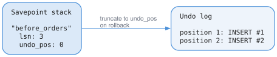
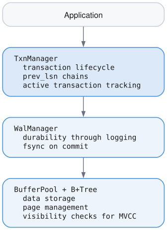

# Transaction Manager

## What is a Transaction?

A transaction is a **logical unit of work** - a group of operations that should either all succeed or all fail together.

| | Without transactions | With transactions |
|---|---|---|
| Step 1 | Debit Alice $100 — succeeds | `BEGIN` |
| Step 2 | Crash | Debit Alice $100 |
| Step 3 | Credit Bob $100 — never runs | Credit Bob $100 |
| Step 4 | — | `COMMIT` |
| **Result** | Alice lost $100 and Bob got nothing | Either both happen or neither does |

## The ACID Properties

Transactions guarantee four properties:

| Property | Meaning | How We Achieve It |
|----------|---------|-------------------|
| **A**tomicity | All or nothing | WAL + rollback |
| **C**onsistency | Valid state to valid state | Application logic |
| **I**solation | Transactions don't interfere | Timestamps + MVCC |
| **D**urability | Committed = permanent | WAL + fsync |

## The Core Data Structures

### Transaction (User-Facing Handle)

This is what the application sees:

```zig
pub const Transaction = struct {
    id: u64,              // Unique identifier (1, 2, 3, ...)
    state: TxnState,      // active, committed, or aborted
    mode: TxnMode,        // read_only or read_write
    isolation: IsolationLevel,  // snapshot, read_committed, serializable
    start_ts: u64,        // When transaction started (for visibility)
    commit_ts: u64,       // When committed (0 until commit)
};
```

### TxnEntry (Internal State)

The manager keeps more detailed state internally:

```zig
const TxnEntry = struct {
    txn: Transaction,           // The user-facing handle
    last_lsn: u64,              // LSN of most recent operation
    begin_lsn: u64,             // LSN of TXN_BEGIN record
    savepoints: ArrayList,      // Stack of savepoints
    undo_log: ArrayList,        // Operations to reverse on abort
};
```

### TxnManager (The Coordinator)

```zig
pub const TxnManager = struct {
    allocator: Allocator,
    wal: *WalManager,                        // For durability
    active_txns: HashMap(u64, TxnEntry),     // All running transactions
    next_txn_id: u64,                        // Counter for IDs
    current_ts: u64,                         // Global timestamp clock
    committed_count: u64,                    // Statistics
    aborted_count: u64,
    mutex: Mutex,                            // Thread safety
};
```

## Transaction Lifecycle

### 1. BEGIN

When you start a transaction:

1. Lock the manager mutex.
2. Assign `txn_id = 1`.
3. Assign `start_ts = 1`.
4. `appendRecord(TXN_BEGIN)` — the WAL returns `lsn = 1`.
5. Create a `TxnEntry` with `last_lsn = 1`.
6. Store it in `active_txns`.
7. Unlock the mutex.
8. Return `Transaction { id = 1, ... }` to the caller.

The `start_ts` is crucial for isolation - it determines what data this transaction can "see".

### 2. Operations

Each modification goes through `logOperation`:

1. Check `txn.canWrite()`.
2. Look up the `TxnEntry`.
3. `appendRecord(INSERT, txn_id = 1, prev_lsn = 1, payload = data)` — `prev_lsn`
   is the entry's current `last_lsn`. The WAL returns `lsn = 2`.
4. Update `last_lsn = 2`.
5. Return `lsn = 2` to the caller.

Notice how `prev_lsn` points to the previous operation. This builds a **backward chain**.

### 3. COMMIT

Commit makes everything permanent:

1. Check that `txn.state == active`.
2. `appendRecord(TXN_COMMIT, prev_lsn = last_lsn)`.
3. `wal.sync()` — this issues the `fsync()`, and it is the point at which the
   transaction becomes durable. Everything before this step can still be lost.
4. Assign `commit_ts`.
5. Set `txn.state = committed`.
6. Remove the entry from `active_txns`.
7. Increment `committed_count`.
8. Return to the caller.

**The critical point**: We only return success to the application AFTER `fsync()` completes. This is the durability guarantee.

Graph, vector, FTS, and stream mutations are staged in a transaction overlay
until commit. At commit time the database logs the semantic graph state needed
for recovery, stages graph changefeed records, flushes the WAL, and then applies
the overlay to the base stores. Large property updates avoid carrying both old
and new full values in commit-time WAL records when redo does not require both;
the changefeed uses summary maps for values that would exceed stream/WAL sizing
limits.

### 4. ABORT

Abort discards everything:

1. `appendRecord(TXN_ABORT)`.
2. `wal.sync()`.
3. Set `txn.state = aborted`.
4. Clean up the `TxnEntry`.
5. Remove it from `active_txns`.
6. Return to the caller.

We log TXN_ABORT so that during crash recovery, we know this transaction was intentionally aborted.

## The prev_lsn Chain

Every record points back to the previous record **from the same transaction**. This creates a linked list through the WAL:

| LSN | Record | Transaction | `prev_lsn` |
|----:|--------|------------:|-----------:|
| 1 | `TXN_BEGIN` | 1 | 0 |
| 2 | `INSERT` | 1 | 1 |
| 3 | `TXN_BEGIN` | 2 | 0 |
| 4 | `UPDATE` | 1 | 2 |
| 5 | `DELETE` | 2 | 3 |
| 6 | `TXN_COMMIT` | 1 | 4 |

Following `prev_lsn` backwards gives each transaction's chain without scanning the
whole log:

- Transaction 1: 6 → 4 → 2 → 1
- Transaction 2: 5 → 3

**Why is this useful?**

1. **Rollback**: To abort transaction 1, follow 6->4->2->1, undoing each operation
2. **Recovery**: After crash, find uncommitted transactions by following chains
3. **No scanning**: Don't need to scan entire WAL to find a transaction's operations

## Savepoints: Partial Rollback

Sometimes you want to undo part of a transaction, not all of it:

```
BEGIN;
    INSERT user Alice;           -- LSN 2
    SAVEPOINT before_orders;     -- Remember this point
    INSERT order #1;             -- LSN 4
    INSERT order #2;             -- LSN 5
    -- Oops, orders were wrong
    ROLLBACK TO before_orders;   -- Undo LSN 4, 5
    INSERT order #3;             -- LSN 7
COMMIT;
```

### How Savepoints Work



When we rollback to savepoint:
1. Find the savepoint by name
2. Log `SAVEPOINT_ROLLBACK` to WAL
3. Truncate undo_log to `undo_position`
4. Remove savepoints created after this one

## Timestamps and Isolation

Every transaction gets two timestamps:

```
start_ts:  Assigned at BEGIN - determines what data is visible
commit_ts: Assigned at COMMIT - marks when changes become visible to others
```

### Snapshot Isolation Example

| Timestamp | Transaction | Event |
|----------:|-------------|-------|
| 1 | Txn A | `BEGIN` — `start_ts = 1` |
| 2 | Txn A | `INSERT x = 100` |
| 3 | Txn B | `BEGIN` — `start_ts = 3` |
| 4 | Txn A | `COMMIT` — `commit_ts = 4` |
| 5 | Txn B | Reads `x` |

Txn B began at `ts = 3`, before Txn A committed at `ts = 4`, so its snapshot does not
include `x = 100` even though the read happens afterwards.

**Question**: What does Txn B see when it reads x?

With **snapshot isolation**: Txn B started at ts=3, before Txn A committed at ts=4. So Txn B does NOT see x=100. It sees whatever x was before Txn A.

This is why we track `start_ts` and `commit_ts` - they determine visibility.

## Read-Only Transactions

Read-only transactions are special:

```zig
var txn = try tm.begin(.read_only, .snapshot);

// This fails:
const result = tm.logOperation(&txn, .insert, "data");
// Error: TxnError.ReadOnly
```

Why have read-only transactions?
1. **No WAL writes** - faster, no disk I/O for reads
2. **No locks needed** - can always proceed
3. **Never abort due to conflicts** - just reads a snapshot
4. **Helps garbage collection** - we know this txn won't modify old versions

## Thread Safety

The TxnManager uses a mutex to protect shared state:

```zig
pub fn begin(self: *Self, ...) TxnError!Transaction {
    self.mutex.lock();         // ← Only one thread at a time
    defer self.mutex.unlock(); // ← Released when function exits

    // Safe to modify next_txn_id, active_txns, etc.
    ...
}
```

This is a simple approach. The mutex is held briefly (microseconds), and the WAL I/O dominates latency anyway.

## Statistics

The manager tracks statistics for monitoring:

```zig
const stats = tm.getStats();

stats.active_count     // Currently running transactions
stats.committed_count  // Total successful commits
stats.aborted_count    // Total aborts
stats.oldest_active_id // Oldest running transaction
stats.current_ts       // Current timestamp
```

`oldest_active_id` is important for garbage collection - we can't clean up any data that this transaction might still need to see.

## API Summary

```zig
var tm = TxnManager.init(allocator, &wal);

// Start a transaction
var txn = try tm.begin(.read_write, .snapshot);

// Log operations
_ = try tm.logOperation(&txn, .insert, payload);
_ = try tm.logOperation(&txn, .update, payload);

// Create savepoint
try tm.savepoint(&txn, "before_danger");

// More operations
_ = try tm.logOperation(&txn, .delete, payload);

// Rollback to savepoint if needed
try tm.rollbackToSavepoint(&txn, "before_danger");

// Commit or abort
try tm.commit(&txn);  // or tm.abort(&txn)
```

## Integration



The Transaction Manager is the **coordinator** - it doesn't store data itself, but ensures that all operations follow ACID rules by orchestrating the WAL, tracking state, and enforcing invariants.
