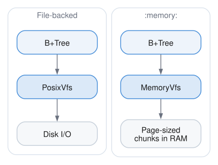
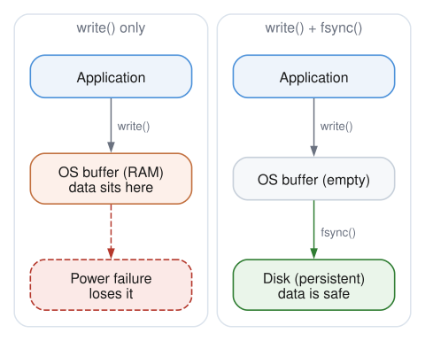

# Virtual File System (VFS)

## What It Is

The Virtual File System is an abstraction layer over file I/O operations. Instead of calling OS functions directly, all file operations go through a VFS interface.

## Why We Need It

### 1. Databases that are not files

The most visible thing this buys is databases with nothing underneath them. Open
`:memory:` and the engine runs against a filesystem held in RAM:



Everything above the interface is unchanged. The B+Tree, the buffer pool, the
write-ahead log, and recovery all run exactly as they do against a disk, because
none of them knows the difference. That is why in-memory support was a new backend
rather than a second path through the engine.

Tests get the same benefit, and run without touching a disk.

### 2. Portability

Different operating systems have different file APIs:
- Linux: `pread`, `pwrite`, `fsync`
- Windows: `ReadFile`, `WriteFile`, `FlushFileBuffers`
- Embedded: Custom flash drivers

The VFS hides these differences. We implement one VFS per platform, and the rest of the database doesn't care.

### 3. Injection of Failures

For testing crash recovery, we need to simulate failures:

```zig
const FaultyVfs = struct {
    inner: Vfs,
    fail_after_n_writes: usize,
    write_count: usize,

    pub fn write(self: *Self, offset: u64, data: []const u8) !void {
        self.write_count += 1;
        if (self.write_count > self.fail_after_n_writes) {
            return error.SimulatedCrash;
        }
        return self.inner.write(offset, data);
    }
};
```

## The Interface

### File Operations

```zig
pub const File = struct {
    ptr: *anyopaque,
    vtable: *const VTable,

    pub const VTable = struct {
        read:     fn(ptr, offset: u64, buf: []u8) Error!usize,
        write:    fn(ptr, offset: u64, data: []const u8) Error!void,
        sync:     fn(ptr) Error!void,
        size:     fn(ptr) Error!u64,
        close:    fn(ptr) void,
        truncate: fn(ptr, size: u64) Error!void,
    };

    // Convenience methods that call vtable
    pub fn read(self: File, offset: u64, buf: []u8) !usize {
        return self.vtable.read(self.ptr, offset, buf);
    }
    // ... etc
};
```

### VFS Operations

```zig
pub const Vfs = struct {
    ptr: *anyopaque,
    vtable: *const VTable,

    pub const VTable = struct {
        open:   fn(ptr, path: []const u8, flags: OpenFlags) Error!File,
        delete: fn(ptr, path: []const u8) Error!void,
        exists: fn(ptr, path: []const u8) bool,
    };
};
```

### Open Flags

```zig
pub const OpenFlags = struct {
    read: bool = true,      // Open for reading
    write: bool = false,    // Open for writing
    create: bool = false,   // Create if doesn't exist
    exclusive: bool = false, // Fail if exists (with create)
};
```

## Key Operations

### Positioned Read/Write

Unlike streaming I/O, we use positioned reads and writes:

```zig
// Read 4096 bytes starting at byte offset 8192
const bytes_read = try file.read(8192, buffer[0..4096]);

// Write 4096 bytes starting at byte offset 8192
try file.write(8192, data[0..4096]);
```

This maps directly to page-based access:
- Page 0 is at offset 0
- Page 1 is at offset 4096
- Page N is at offset N * 4096

### Sync (fsync)

The most important operation for durability:

```zig
try file.sync();
```

This forces all pending writes to physical storage. Without it, data might sit in OS buffers and be lost on power failure.



## The POSIX Implementation

For Unix-like systems (Linux, macOS):

```zig
pub const PosixVfs = struct {
    allocator: Allocator,

    pub fn open(self: *Self, path: []const u8, flags: OpenFlags) !File {
        var posix_flags: u32 = 0;

        if (flags.read and flags.write) {
            posix_flags |= O_RDWR;
        } else if (flags.write) {
            posix_flags |= O_WRONLY;
        } else {
            posix_flags |= O_RDONLY;
        }

        if (flags.create) posix_flags |= O_CREAT;
        if (flags.exclusive) posix_flags |= O_EXCL;

        const fd = try std.posix.open(path, posix_flags, 0o644);
        // ... wrap in File struct
    }
};
```

### Read Implementation

Uses `pread` for positioned reading (thread-safe, no seeking):

```zig
fn read(self: *PosixFile, offset: u64, buf: []u8) !usize {
    return std.posix.pread(self.fd, buf, offset);
}
```

### Write Implementation

Uses `pwrite` for positioned writing:

```zig
fn write(self: *PosixFile, offset: u64, data: []const u8) !void {
    var written: usize = 0;
    while (written < data.len) {
        const n = try std.posix.pwrite(self.fd, data[written..], offset + written);
        if (n == 0) return error.DiskFull;
        written += n;
    }
}
```

### Sync Implementation

```zig
fn sync(self: *PosixFile) !void {
    try std.posix.fsync(self.fd);
}
```

## The Memory Implementation

`MemoryVfs` holds files in RAM. It backs `:memory:` databases and databases
opened from bytes, and it is a real backend rather than a testing convenience.

### Files are chunks, not one buffer

A file is a list of page-sized pieces:

```zig
const Chunk = union(enum) {
    borrowed: []const u8,
    owned: []u8,
};
```

The obvious implementation is one growing buffer, and it is the wrong one. A
growing buffer has to be reallocated as the file extends, and a reallocation moves
every byte to a new address. Anything holding a slice from before that moment is
left pointing at freed memory.

That matters because lending slices is the point. A database opened from a caller's
bytes can point at them instead of copying, which halves what loading costs. That
is only possible if addresses are stable, so chunks came first and the lending was
built on top.

### Copy-on-write

A chunk either owns its bytes or borrows them from whoever handed them over.
Writing to a borrowed chunk copies it first, at page granularity.

So a database loaded from a blob starts out borrowing all of itself, and only the
pages actually modified become private copies. Reading a database and changing a
little of it keeps one copy of nearly all of it, and the caller's buffer is never
modified.

### Locking is a no-op

Every lock succeeds. A lock exists to keep a second process off a database, and no
other process can reach memory this one owns. That is a decision rather than an
omission: file-backed databases take a real lock and refuse a second opener, and
this backend declines to pretend there is anything to exclude.

### What it costs

Peak memory is the database plus the buffer pool, and the pool is a small constant
here — see [Buffer Pool](./buffer-pool.md) for why a cache barely matters when the
storage underneath it is already RAM.

```text
   100 nodes | database    240 KB | pool 256 KB | 2.62x
  4000 nodes | database   7416 KB | pool 256 KB | 1.04x
 10000 nodes | database  18432 KB | pool 256 KB | 1.01x
```

The overhead at small sizes is mostly the write-ahead log, which is a second file
in the same backend. It shrinks as automatic checkpointing truncates it, which is
why the ratio falls rather than rises as the database grows.

The log stays enabled in memory, incidentally, and that is worth knowing. Turning
it off looks free — a process holding the only copy of a database loses everything
when it dies anyway — but transactions are built on it, so a database without a log
has no `BEGIN`, no rollback, and no multi-statement atomicity.

## Error Handling

VFS operations can fail in various ways:

```zig
pub const VfsError = error{
    FileNotFound,      // Path doesn't exist
    PermissionDenied,  // No access rights
    DiskFull,          // No space left
    IoError,           // Hardware failure
    FileLocked,        // Another process has it
    InvalidPath,       // Bad path string
    AlreadyExists,     // Exclusive create failed
};
```

These are translated from OS-specific error codes:

```zig
fn mapPosixError(err: std.posix.Error) VfsError {
    return switch (err) {
        .ENOENT => VfsError.FileNotFound,
        .EACCES, .EPERM => VfsError.PermissionDenied,
        .ENOSPC => VfsError.DiskFull,
        .EIO => VfsError.IoError,
        // ...
    };
}
```

## Usage Pattern

```zig
// Create VFS
var posix_vfs = PosixVfs.init(allocator);
const vfs = posix_vfs.vfs();  // Get interface

// Open file
const file = try vfs.open("database.db", .{
    .read = true,
    .write = true,
    .create = true,
});
defer file.close();

// Read page 5
var buf: [4096]u8 = undefined;
_ = try file.read(5 * 4096, &buf);

// Modify and write back
buf[0] = 42;
try file.write(5 * 4096, &buf);

// Ensure durability
try file.sync();
```

## Why Not Just Use std.fs?

Zig's standard library has file operations, but:

1. **No positioned I/O** - `std.fs.File` uses streaming with seek, which isn't thread-safe
2. **No vtable pattern** - Can't swap implementations
3. **Different error types** - We want database-specific errors

The VFS is a thin layer, but it gives us control where we need it.
