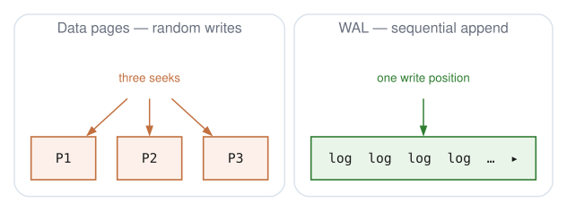
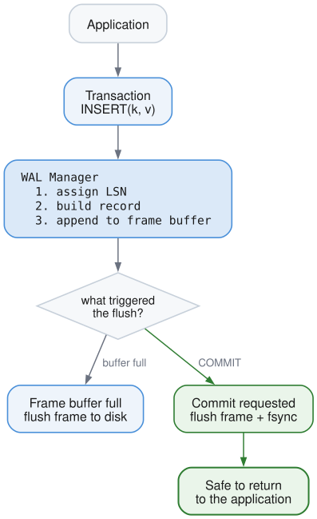
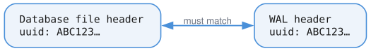

# Write-Ahead Log (WAL)

## The Problem

Imagine you're updating a B+Tree. You need to:
1. Modify a leaf page
2. Maybe split it (modify parent)
3. Maybe split the parent (modify grandparent)
4. Update the root

If power fails between steps 2 and 3, your database is **corrupted** - the tree structure is broken.

Even a single page write isn't safe. A 4KB page write might not be atomic at the hardware level - you could end up with half old data, half new data (a "torn write").

## The Insight

Instead of modifying data pages directly, first write a **log** of what you intend to do. The log is append-only and sequential. Only after the log is safely on disk do you modify the actual data pages.

If you crash:
- **Before log write**: Nothing happened, no corruption
- **After log write, before data write**: Replay the log to finish the operation
- **After both**: Everything is fine

This is the **write-ahead** rule: log first, then data.

## Why Append-Only Sequential Writes Are Special

The WAL relies on a key property: **sequential append is much safer than random writes**.



With random writes, the disk head jumps around. A crash can leave any combination of pages in inconsistent states.

With sequential append:
- Only one "frontier" where writing happens
- Everything before the frontier is complete
- Everything after doesn't exist yet
- Much simpler to reason about crash states

## The System Primitive: fsync

The WAL's safety depends on one critical system call: **fsync** (or fdatasync).

```c
write(fd, data, len);  // Data goes to OS buffer cache
fsync(fd);             // Forces data to physical disk platters
```

Without fsync, your "written" data might sit in RAM for seconds or minutes. A power failure loses it. fsync is a **durability barrier** - when it returns, data is on persistent storage.

This is expensive (milliseconds, not microseconds), so we batch multiple records into frames before syncing.

## WAL Structure

The WAL file is a 4 KB header followed by a sequence of 4 KB frames.

**WAL header (4 KB)**

| Field | Purpose |
|-------|---------|
| `magic` | `0x574C4F47` (`"WLOG"`) |
| `database_uuid` | Binds this WAL to one database file |
| `frame_count` | How many frames have been written |
| `checkpoint_lsn` | Where recovery starts replaying |
| `checksum` | Detects header corruption |

**Frame header (32 bytes, at the start of every 4 KB frame)**

| Field | Purpose |
|-------|---------|
| `frame_number` | Position of this frame in the file |
| `record_count` | How many records the frame carries |
| `data_size` | Bytes of the frame actually used |
| `checksum` | CRC32 over the frame's data area |

The remainder of each frame holds records back to back, then unused space. A frame
carrying a single-statement transaction might look like this:

| LSN | Record | Transaction |
|----:|--------|------------:|
| 1 | `TXN_BEGIN` | 1 |
| 2 | `INSERT` (with payload) | 1 |
| 3 | `TXN_COMMIT` | 1 |

## LSN: The Universal Clock

Every record gets a **Log Sequence Number (LSN)** - a monotonically increasing integer.

```
LSN 1: TXN_BEGIN (txn 1)
LSN 2: INSERT key="alice" (txn 1)
LSN 3: INSERT key="bob" (txn 1)
LSN 4: TXN_BEGIN (txn 2)
LSN 5: DELETE key="charlie" (txn 2)
LSN 6: TXN_COMMIT (txn 1)
LSN 7: TXN_ABORT (txn 2)
```

LSN serves multiple purposes:
1. **Ordering**: Total order of all operations
2. **Recovery point**: "Replay from LSN 42"
3. **Page tracking**: Each data page stores the LSN of the last modification

## The prev_lsn Chain

Each record stores `prev_lsn` - the previous LSN **for the same transaction**:

| LSN | Record | Transaction | `prev_lsn` |
|----:|--------|------------:|-----------:|
| 1 | `TXN_BEGIN` | 1 | 0 |
| 2 | `INSERT` | 1 | 1 |
| 3 | `INSERT` | 2 | 0 |
| 4 | `UPDATE` | 1 | 2 |
| 5 | `TXN_COMMIT` | 1 | 4 |

Following `prev_lsn` from LSN 5 walks transaction 1 backwards — 5 → 4 → 2 → 1 —
skipping LSN 3, which belongs to transaction 2.

This creates a **backward chain** for each transaction:

```
Transaction 1: LSN 5 → LSN 4 → LSN 2 → LSN 1
Transaction 2: LSN 3 (just one operation)
```

Why? **Rollback**. To abort transaction 1, follow the chain backward, undoing each operation.

## Write Flow



The key insight: we buffer multiple records in memory, only hitting disk when:
1. The frame buffer is full (4KB of records accumulated)
2. A transaction commits (durability guarantee)

Logical WAL records can be larger than a single frame. Large graph, stream, and
property payloads are fragmented into physical `large_fragment` records and
reassembled by recovery before redo. The logical payload limit is `64 MiB`; a
record above that limit returns `ValueTooLarge`.

## Commit Protocol

When you call `COMMIT`:

```
1. Write TXN_COMMIT record to WAL buffer
2. Flush current frame to disk
3. Call fsync() - WAIT for disk acknowledgment
4. Return "committed" to application
```

After step 3, even if power fails immediately, the commit record is on disk. Recovery will see the commit and know the transaction succeeded.

If we crash before step 3? The commit record might be lost. Recovery won't see a commit for that transaction, so it will be rolled back. **No partial commits ever escape to the application.**

## Recovery: Redo and Undo

On startup after a crash, we need to:

1. **Find the end of valid log** - Scan frames, verify checksums, find last valid record
2. **Redo committed transactions** - Replay all operations from committed transactions
3. **Undo uncommitted transactions** - Roll back any transaction without a commit record

| LSN | Record | Transaction |
|----:|--------|------------:|
| 1 | `TXN_BEGIN` | 1 |
| 2 | `INSERT x=1` | 1 |
| 3 | `TXN_BEGIN` | 2 |
| 4 | `INSERT y=2` | 2 |
| 5 | `TXN_COMMIT` | 1 |
| 6 | `INSERT z=3` | 2 |

The process crashes after LSN 6.

| Transaction | Has `TXN_COMMIT`? | Recovery action |
|------------:|-------------------|-----------------|
| 1 | Yes | Redo — `x=1` is permanent |
| 2 | No | Undo — `y=2` and `z=3` are rolled back |

## Why Frames?

Why not just append individual records?

**Reason 1: Atomicity**

A 4KB write is more likely to be atomic than arbitrary-sized writes. Many storage systems guarantee 512-byte or 4KB atomic writes. By aligning to page boundaries, we reduce torn write risk.

**Reason 2: Batching**

Each fsync is expensive (~1-10ms). By batching records into frames, we amortize the sync cost across many operations.

**Reason 3: Checksums**

Each frame has a checksum. During recovery, we can detect partial/corrupted frames and stop replay at the right point.

**Reason 4: Large logical records**

Frames remain page-sized for torn-write detection and batching, but the WAL no
longer requires each logical record to fit inside one frame. Fragmentation keeps
large transactional property updates on the WAL path without changing the frame
format used for normal records.

## The Checksum

We use CRC32 to detect corruption:

Every frame stores a CRC32 of its data area in its header:

| Frame region | Contents |
|--------------|----------|
| Header | `checksum = 0xABCD1234` |
| Data | `[record 1][record 2][record 3]` |

On read the checksum is recomputed and compared:

1. Read the frame.
2. Compute `CRC32(data)`.
3. Compare against the stored checksum.
4. On mismatch, corruption is detected and replay stops.

This catches:
- Torn writes (partial frame written)
- Bit rot (storage degradation)
- Wrong WAL file (UUID also checked)

## The UUID Link

The WAL header stores the database file's UUID:



This prevents accidentally using database A's WAL with database B. The UUID is generated randomly when the database is created.

## Record Types

```zig
pub const WalRecordType = enum(u8) {
    // Transaction control
    txn_begin = 0x01,
    txn_commit = 0x02,
    txn_abort = 0x03,

    // Data modifications
    insert = 0x10,
    update = 0x11,
    delete = 0x12,

    // Page-level operations
    page_write = 0x20,

    // Checkpointing
    checkpoint_begin = 0x30,
    checkpoint_end = 0x31,

    // Savepoints
    savepoint = 0x40,
    savepoint_rollback = 0x41,

    // Compensation (for undo during recovery)
    clr = 0x50,
};
```

## WalManager API

```zig
// Append a record, get back its LSN
const lsn = try wal.appendRecord(.insert, txn_id, prev_lsn, payload);

// Force all buffered records to disk
try wal.sync();

// Iterate records for recovery
var iter = wal.iterate(start_lsn);
while (try iter.next(&buf)) |record| {
    // Process record
}

// Update checkpoint position
try wal.setCheckpointLsn(lsn);
```

## Summary

| Concept | Purpose |
|---------|---------|
| Write-ahead rule | Log before data = crash safety |
| Sequential append | Simpler crash states than random writes |
| fsync | Durability barrier to physical storage |
| LSN | Universal ordering of all operations |
| prev_lsn chain | Enables transaction rollback |
| Frames | Atomic-ish writes + batching |
| Checksums | Detect corruption and torn writes |
| UUID | Match WAL to correct database file |

The WAL transforms the problem from "make random writes atomic" (very hard) to "make sequential append reliable" (much easier).
